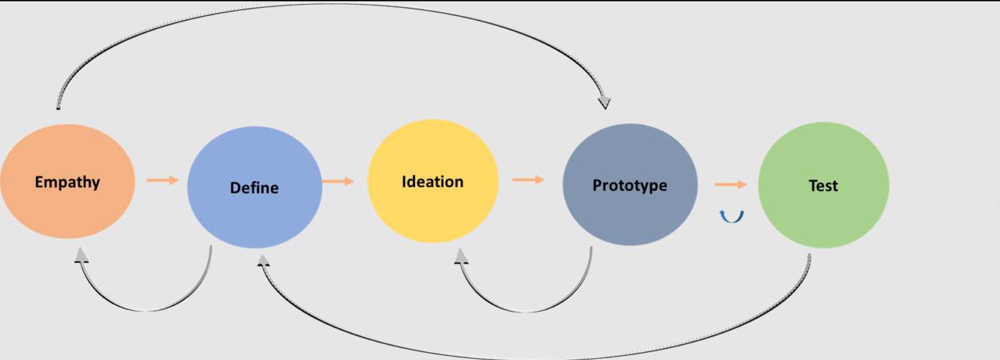
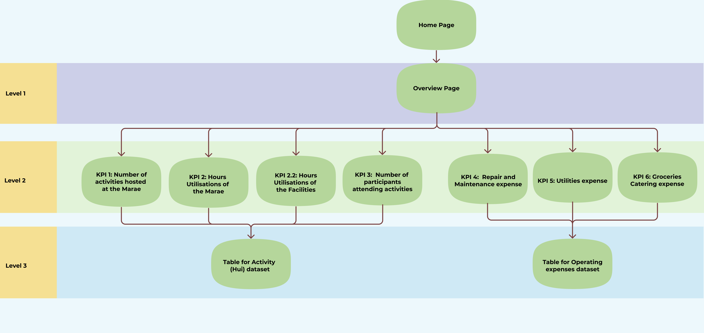

# Waihopai-Runaka-Analytics-Project

## Introduction & Background
Te Rūnaka o Waihōpai is based in Southland with the Murihiku Marae situated 
in Invercargill serving as its cultural heart . Over the last 8 years,
Waihopai Rūnaka have been working on the redevelopment of the Murihiku 
Marae. This rebuild will demolish existing buildings to build a sustainable
cultural and community hub. Marking the beginning of a new journey for
Waihōpai Rūnaka (‘the Rūnaka’) in meeting the needs of the Rūnaka and 
local communities for now and future generations. The Rūnaka have asked 
for our expertise to help them in providing an understanding of the value
added by the redevelopment of Murihiku Marae using data visualisation
tools. For confidentiality purposes, I will not go through the data 
acquisition process as well as the data cleaning process for the project
in this article. I will instead focus on how I design and develop a performance
measurement dashboard.

 
 

## Design Thinking Process
I apply the Design Thinking process (Figure 1) to approach this project.

<figcaption align="center">Figure 1: Design thinking process</figcaption>

I followed a design thinking framework to develop the dashboard. 
This consists of five elements: (1) empathise with the dashboard users, 
(2) define the questions users would want to answer with the dashboard, 
(3) ideate as many ideas as I can, (4) prototype the dashboard, and (5)
test the prototype with the internal team and then with the Rūnaka team. 

Note: Design thinking is not a linear, step-by-step process,
for example, I empathize with the users, then define the problem, and I 
present the problem to the end users to get feedback. Then, I come back to 
really empathize and understand the deepest needs of the end users. I continue
this process until the core problem is addressed.

 

### Persona mapping
To empathize and define the problem, I employed a persona definition process mapping, this consists of four elements:
defining users, identify a set of questions users would want to answer, the
third element considered what factors might impact on the experience of 
using the dashboard, and the final element considers how the dashboard
would be used in practice. Below is a animated gif showing the persona mapping 
(Figure 2).

  
  <figcaption align="center">Figure 2: Persona Mapping</figcaption>

 

### Dashboard structure
Next, I created a dashboard structure which maps out the structure of the 
dashboard (Figure 3). This  shows a hierarchical structure that provides
different views as you drill down into the data. This enables the end users 
to look at the data and interrogate it

  
  <figcaption align="center">Figure 3: Dashboard Structure</figcaption>

 

### Dashboard prototype
A prototype can be created at very early phases of the project. And I did create
a minimum-viable-product at the beginning of the project to see what is possible
and to explore ideas I may have. It is very useful to have a concrete example of
what the end result would look like even at the very beginning. However, following 
the design thinking framework allow me to see what the users actually need rather
than what I think they should use. Hence, I developed a new prototype dashboard
that takes into account the understandings of end uders and the core problems 
identified and to be addressed by the dashboard.

Two-way communications and multiple testing and feedback sessions occur in this 
phase of the project

 

### Final deliverable
Finally, I deliver the final performance dashboard to the end users at the Runaka. Below is a brief showcase of the end product. (Figure 4)

*Notice: all the data in this dashboard is fake data, the dashboard is just a working prototype.*

  
  <figcaption align="center">Figure 4: Dashboard Showcase</figcaption>

